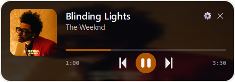
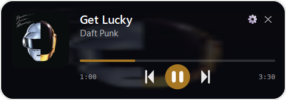
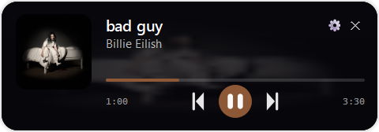
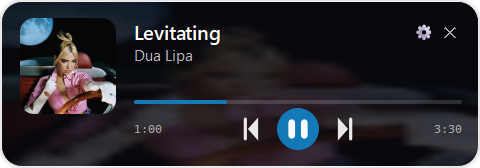

<h1 align="center">OverlayMusic</h1>

<p align="center">
  <em>Лёгкий always-on-top оверлей для управления музыкой поверх любой игры — Windows и macOS.<br>
  Каждый трек подсвечивает интерфейс цветом своей обложки.</em>
</p>

<p align="center">
  <a href="../../actions/workflows/build.yml"></a>
  <a href="../../releases/latest"></a>
  
  
</p>

<p align="center">
  
</p>

<p align="center">
  
  
  
</p>

---

## Что это

Маленькое (~480×170) полупрозрачное окно поверх всех окон, которое показывает текущий трек и даёт управлять плеером без alt-tab из игры. **Дизайн меняется под каждую песню** — обложка размывается в фон карточки, а прогресс-бар и play-кнопка перекрашиваются под её доминирующий цвет.

Работает с **любым** плеером, который умеет в системные media-controls:

- **Windows** — SMTC: Spotify, Yandex.Music, AIMP, foobar2000, Tidal, MusicBee, любой браузер с YouTube/SoundCloud
- **macOS** — MediaRemote: Apple Music, Spotify, Deezer, любой Now Playing-источник

## Возможности

- 🎮 **Поверх любой игры** — frameless, always-on-top, fade-in/out 220мс с easing
- 🎨 **Cover-derived theming** — обложка → blur backdrop, палитра → accent color
- 🎵 **Управление** play/pause/prev/next через системный API + горячие клавиши
- 🌍 **Глобальный хоткей** — настраивается, по умолчанию `Ctrl+Alt+S`
- 💜 **Discord Rich Presence** — статус «Слушает …» с обложкой, временем и кнопкой «Открыть трек»
- 🔗 **Прямая ссылка на трек** в Я.Музыке (через их публичный API), Spotify, YouTube Music, Apple Music
- 🖼️ **Реальные обложки в Discord** — байты загружаются на catbox.moe и подаются в presence как `large_image`

## Установка

### Windows
Скачай `OverlayMusic-Setup-X.Y.Z.exe` из [Releases](../../releases) и запусти.<br>
Установка per-user, не требует прав администратора. По желанию — отметь «Запускать при входе в Windows».

### macOS (Apple Silicon)
1. Скачай `OverlayMusic-arm64.dmg` из [Releases](../../releases)
2. Открой .dmg, перетащи **OverlayMusic** в **Applications**
3. Первый запуск: **ПКМ → Open** → подтверди (приложение не подписано Apple Developer ID — это безопасно, просто так требует Gatekeeper для не-AppStore приложений)
4. Дай разрешение **Accessibility** в `System Settings → Privacy & Security → Accessibility` — нужно для глобального хоткея

Если приложение совсем не запускается:
```bash
xattr -dr com.apple.quarantine /Applications/OverlayMusic.app
```

## Использование

| Действие | Hotkey | Где |
|---|---|---|
| Показать / скрыть оверлей | `Ctrl+Alt+S` (Win) / `Cmd+Opt+S` (Mac) | Глобально |
| Предыдущий трек | `←` | В фокусе оверлея |
| Следующий трек | `→` | В фокусе оверлея |
| Пауза / воспроизведение | `↓` | В фокусе оверлея |
| Скрыть оверлей | `Esc` | В фокусе оверлея |
| Настройки | ПКМ по иконке в трее | — |

Все хоткеи **настраиваются** в трее → Настройки.

## Discord Rich Presence

По умолчанию используется встроенный Application ID. Чтобы поменять имя, которое отображается в Discord («Слушает X»), и иконку:

1. Создай приложение на [discord.com/developers/applications](https://discord.com/developers/applications) (1 минута, кнопка `New Application`)
2. На странице приложения скопируй **Application ID** и опционально загрузи **App Icon**
3. В оверлее: трей → Настройки → секция Discord → вставь ID

Кнопка-ссылка под presence-картой (Я.Музыка / Spotify / YouTube Music / Apple Music) настраивается там же.

## Сборка из исходников

```bash
git clone https://github.com/Loretiks/OverlayMusic.git
cd OverlayMusic
python -m venv .venv
# Windows: .venv\Scripts\activate
# macOS:   source .venv/bin/activate
pip install -r requirements.txt
python overlay.py
```

### Сборка `.exe` (Windows)
```cmd
build.bat              # генерит dist\OverlayMusic.exe
build-installer.bat    # дополнительно собирает Inno Setup .exe
```

### Сборка `.app` (macOS)
```bash
pip install pyinstaller
pyinstaller --noconfirm --windowed --name OverlayMusic \
  --hidden-import _platform_mac --exclude-module _platform_win overlay.py
codesign --force --deep --sign - dist/OverlayMusic.app
```

Готовые сборки для обеих ОС появляются автоматически в [Releases](../../releases) после каждого тега вида `v1.2.3` — собираются GitHub Actions.

## Архитектура

| Файл | Назначение |
|---|---|
| `overlay.py` | UI (PySide6) + кросс-платформа: Discord, Я.Музыка search, обложки через iTunes/catbox, настройки |
| `_platform_win.py` | Windows-бекэнд: SMTC через winrt + RegisterHotKey + AttachThreadInput |
| `_platform_mac.py` | macOS-бекэнд: MediaRemote (private framework) + NSEvent global monitor |

`overlay.py` импортирует нужный бекэнд по `sys.platform`. У них одинаковый интерфейс: `MediaController`, `HotkeyManager`, `force_foreground`.

CI workflow в `.github/workflows/build.yml`:
- Windows job → `windows-latest` → PyInstaller → Inno Setup
- macOS job → `macos-14` (Apple Silicon) → PyInstaller → ad-hoc codesign → create-dmg

## Известные ограничения

- **Я.Музыка не репортит позицию в SMTC** — оверлей считает время локально от смены трека. Первый трек после запуска оверлея может показывать неточную позицию; со второго трека всё точно.
- **macOS требует Accessibility-разрешения** для глобального хоткея (системная политика — не наш выбор).
- **Mac-версия не подписана** Apple Developer ID. При первом запуске нужен ПКМ → Open. Без warning-а — нужен Apple Developer ($99/год) и notarization.
- **MediaRemote.framework** на macOS — приватный API Apple. Стабилен годами (его используют Sleeve, NepTunes, Music Bar и др.), но официально не поддерживается.

## Лицензия

[MIT](LICENSE) — пользуйся как хочешь.
